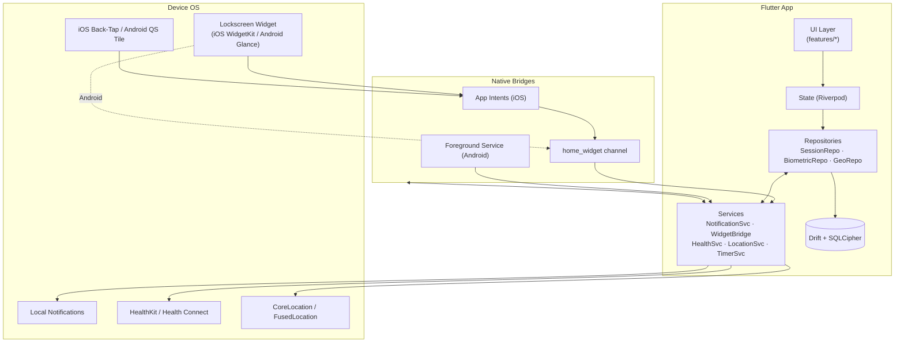
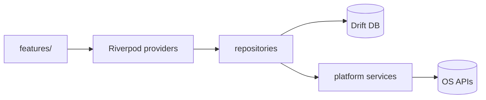

# System Architecture

## High-level



## Layered View



## Module Map

```
lib/
├── app/          bootstrap, router
├── core/         theme, result types
├── data/
│   ├── db/       drift schema + DAOs
│   ├── repo/     Session/Biometric/Geo
│   └── services/ Notification/Widget/Health/Location/Timer
├── features/
│   ├── session/  start · active · end
│   ├── dashboard/history · charts · triggers
│   ├── tag/      picker · retro-edit
│   └── settings/ perms · sync · export
└── shared/       widgets, utils
```
