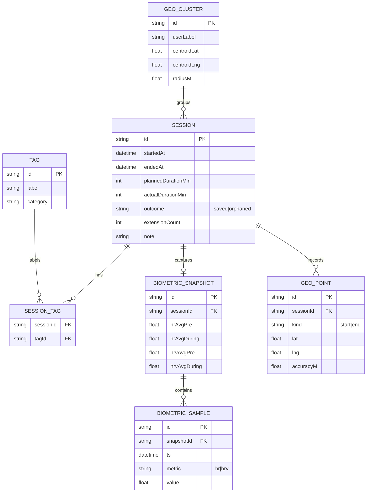

# Data Model

## ERD

```mermaid
erDiagram
    SESSION ||--o{ SESSION_TAG : has
    TAG ||--o{ SESSION_TAG : labels
    SESSION ||--o| BIOMETRIC_SNAPSHOT : captures
    SESSION ||--o{ GEO_POINT : records
    BIOMETRIC_SNAPSHOT ||--o{ BIOMETRIC_SAMPLE : contains
    GEO_CLUSTER ||--o{ SESSION : groups

    SESSION {
        string id PK
        datetime startedAt
        datetime endedAt
        int plannedDurationMin
        int actualDurationMin
        string outcome "saved|orphaned"
        int extensionCount
        string note
    }
    TAG {
        string id PK
        string label
        string category
    }
    SESSION_TAG {
        string sessionId FK
        string tagId FK
    }
    BIOMETRIC_SNAPSHOT {
        string id PK
        string sessionId FK
        float hrAvgPre
        float hrAvgDuring
        float hrvAvgPre
        float hrvAvgDuring
    }
    BIOMETRIC_SAMPLE {
        string id PK
        string snapshotId FK
        datetime ts
        string metric "hr|hrv"
        float value
    }
    GEO_POINT {
        string id PK
        string sessionId FK
        string kind "start|end"
        float lat
        float lng
        float accuracyM
    }
    GEO_CLUSTER {
        string id PK
        string userLabel
        float centroidLat
        float centroidLng
        float radiusM
    }
```

## Derived

- `Trigger` — runtime view over sessions grouped by tag / hour-band / cluster.
- `Streak` — computed from session dates, not stored.
