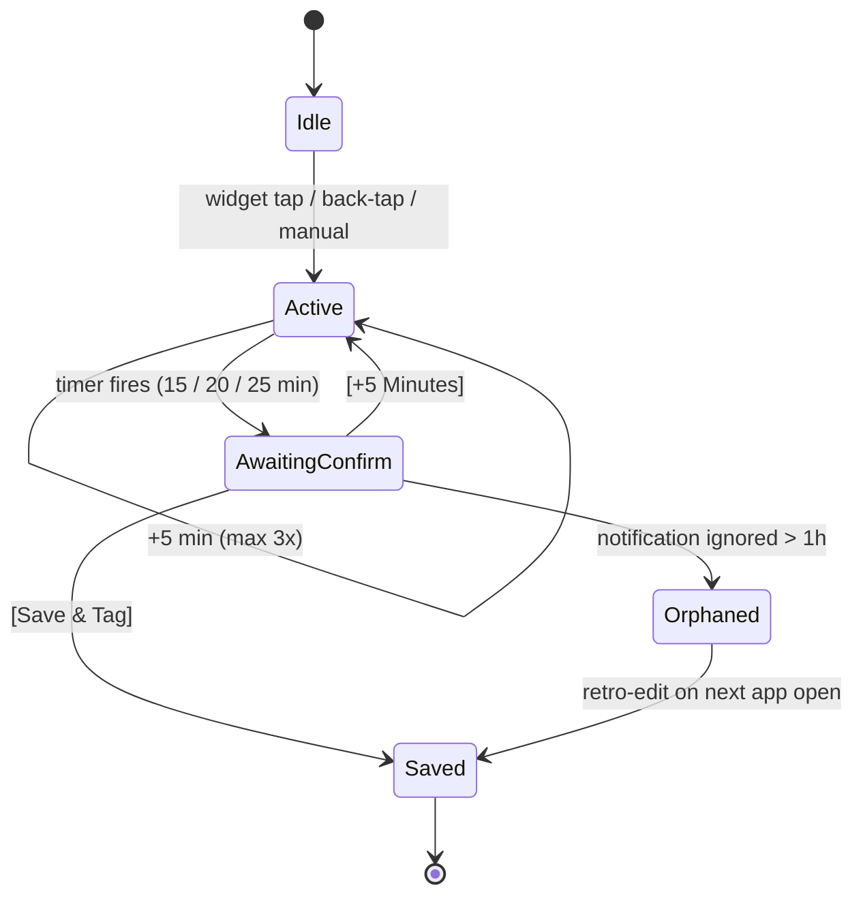
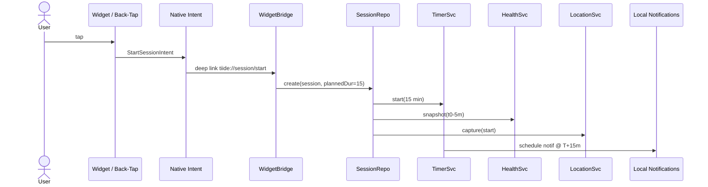
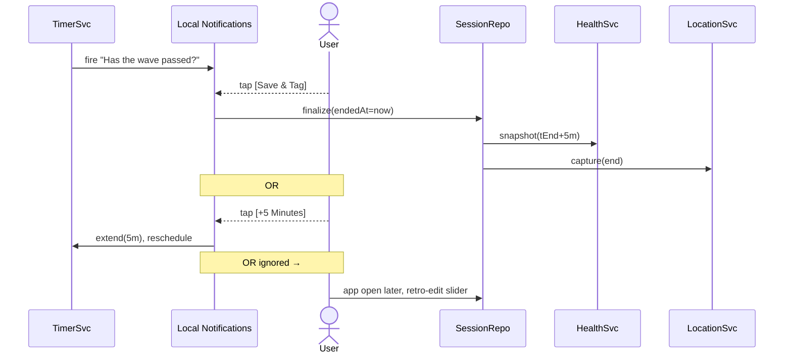
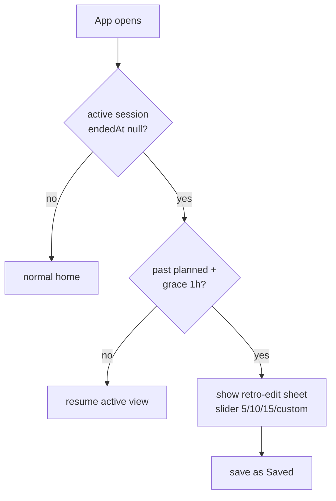

# Session Flow

## State Machine

```mermaid
stateDiagram-v2
    [*] --> Idle
    Idle --> Active: widget tap / back-tap / manual
    Active --> Active: +5 min (max 3x)
    Active --> AwaitingConfirm: timer fires (15 / 20 / 25 min)
    AwaitingConfirm --> Saved: [Save & Tag]
    AwaitingConfirm --> Active: [+5 Minutes]
    AwaitingConfirm --> Orphaned: notification ignored > 1h
    Orphaned --> Saved: retro-edit on next app open
    Saved --> [*]
```

## Start Sequence

```mermaid
sequenceDiagram
    actor U as User
    participant W as Widget / Back-Tap
    participant N as Native Intent
    participant B as WidgetBridge
    participant R as SessionRepo
    participant T as TimerSvc
    participant H as HealthSvc
    participant G as LocationSvc
    participant L as Local Notifications

    U->>W: tap
    W->>N: StartSessionIntent
    N->>B: deep link tiide://session/start
    B->>R: create(session, plannedDur=15)
    R->>T: start(15 min)
    R->>H: snapshot(t0-5m)
    R->>G: capture(start)
    T->>L: schedule notif @ T+15m
```

## End Sequence

```mermaid
sequenceDiagram
    participant T as TimerSvc
    participant L as Local Notifications
    actor U as User
    participant R as SessionRepo
    participant H as HealthSvc
    participant G as LocationSvc

    T->>L: fire "Has the wave passed?"
    U-->>L: tap [Save & Tag]
    L->>R: finalize(endedAt=now)
    R->>H: snapshot(tEnd+5m)
    R->>G: capture(end)
    Note over U,L: OR
    U-->>L: tap [+5 Minutes]
    L->>T: extend(5m), reschedule
    Note over U,L: OR ignored →
    U->>R: app open later, retro-edit slider
```

## Retro-Edit Decision

```mermaid
flowchart TD
    A[App opens] --> B{active session<br/>endedAt null?}
    B -- no --> Z[normal home]
    B -- yes --> C{past planned +<br/>grace 1h?}
    C -- no --> D[resume active view]
    C -- yes --> E[show retro-edit sheet<br/>slider 5/10/15/custom]
    E --> F[save as Saved]
```
